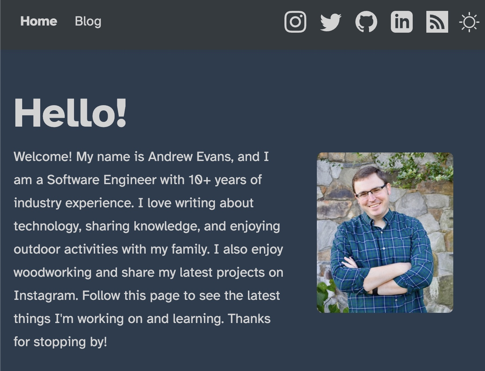

# Andrew Evans Personal Blog Site

Welcome! This is my personal blog site which I try to update regularly.

This site replaces my previous personal blog RhythmAndBinary.com.

This project was originally cloned from the [vercel astro starter blog](https://github.com/withastro/astro/tree/main/examples/blog).

I use netlify for hosting, and you can reach the site at [andrewevans.dev](https://www.andrewevans.dev).

I have moved all the posts from my previous site (RhythmAndBinary.com) over to this project.

Some features that the site has include:
- Dark and Light Theme
- Markdown to HTML conversion
- RSS Feed
- Use of Google Analytics
- React plugin for post page
- Support for MDX files (not using currently)
- Posts organiezed by tag
- Ability to search posts by title

Thanks for stopping by!

